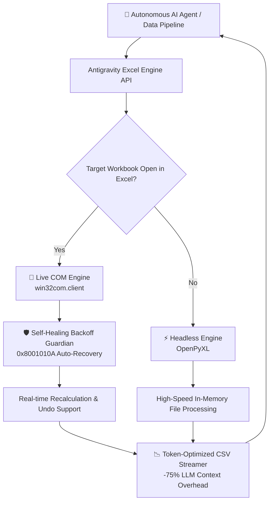

<div align="center">

# ⚡ Antigravity Excel Engine

**The Enterprise-Grade, AI-Native Excel Automation Engine for Autonomous Agents & Data Pipelines.**

[](https://pypi.org)
[](https://opensource.org/licenses/MIT)
[](#-dual-core-architecture)
[](#-architecture--guardians)
[](#-token-optimized-streamer)

<p align="center">
  <a href="#-the-problem">The Problem</a> •
  <a href="#-key-features">Key Features</a> •
  <a href="#-quickstart">Quickstart</a> •
  <a href="#-cli-for-ai-agents">CLI Interface</a> •
  <a href="#-feature-matrix">Comparison Matrix</a> •
  <a href="#-contributing">Contributing</a>
</p>

</div>

---

## 💡 Why Antigravity Excel Engine?

Building autonomous AI agents (LangChain, AutoGen, CrewAI, MCP Sidecars) or robotic process automations that interact with Microsoft Excel is notoriously fragile:

* 💥 **Interactive Freezes (`0x8001010A`):** Classic COM libraries immediately crash with `RPC_E_SERVERCALL_RETRYLATER` if a user is actively typing in a cell.
* 💸 **Token Context Window Exhaustion:** Sending verbose JSON structures or raw matrices to LLMs burns through context windows and multiplies inference costs.
* 🧟 **Zombie Process Nightmares:** Unhandled exceptions frequently leave hidden, hung `EXCEL.EXE` processes in background memory, locking files forever.
* 🐢 **OpenPyXL Blind Spots:** Headless file manipulation cannot recalculate volatile formulas or evaluate live spreadsheets in real-time.

**Antigravity Excel Engine** completely eliminates these friction points with an adaptive **Dual-Core runtime**, automated **Token Compression**, self-healing **COM lock recovery**, and a guaranteed **Zero-Leak process lifecycle**.

---

## 🚀 Key Features

* **🔄 Dual-Core Hybrid Runtime:** Seamlessly detects whether the target spreadsheet is currently open in Microsoft Excel.
  * *File Open?* Engages **Live COM** for real-time recalculation, dynamic formula evaluation, visual updates, and full `Ctrl+Z` Undo history.
  * *File Closed?* Switches automatically to **Headless OpenPyXL** for maximum throughput and server-grade speed.
* **📉 75% LLM Token Compression:** Packs tabular data into dense, normalized CSV streams designed specifically for LLM prompt context injection instead of wasteful JSON serialization.
* **🛡️ Self-Healing Cell Guardian:** Employs exponential adaptive backoff to gracefully intercept interactive editing states, waiting for human input to finish instead of throwing COM errors.
* **⚡ Declarative Atomic Mapping:** Update values, formulas, comments, RGB styles, borders, and column auto-fitting in a single atomic transaction.
* **🔍 Formula Error Sentinel:** Automatically audits ranges for evaluation errors (`#VALUE!`, `#REF!`, `#DIV/0!`, `#N/A`, `#NAME?`) before saving or reporting back to agents.
* **🤖 CLI with Deterministic JSON:** Native command-line interface with `--json` flags for zero-friction integration into agentic workflows and tool-calling frameworks.

---

## 🏗 Dual-Core Architecture



---

## ⚡ Quickstart

### 1. Installation

```bash
# Clone the repository
git clone https://github.com/FranciscoGrandon/antigravity-excel-engine.git
cd antigravity-excel-engine

# Install dependencies
pip install -r requirements.txt
```

### 2. Python API in 30 Seconds

```python
from antigravity_excel_core import AntigravityExcelEngine

# Initialize (auto-detects Live COM vs Headless OpenPyXL)
engine = AntigravityExcelEngine(mode="auto", file_path="financial_model.xlsx")

# 1. Read token-optimized stream (ideal for LLM prompt context)
csv_stream = engine.get_range_as_csv("A1:D50")
print(csv_stream)

# 2. Apply declarative atomic updates with styles & formulas
engine.set_cells({
    "A1": {
        "value": "Total Revenue",
        "cellStyles": {"fontWeight": "bold", "backgroundColor": "#0E2E63", "fontColor": "#FFFFFF"}
    },
    "B1": {
        "formula": "=SUM(B2:B10)",
        "cellStyles": {"numberFormat": "$#,##0.00"}
    },
    "A2": {
        "value": "Autonomous Agent Note",
        "note": "Audited and verified by Antigravity Engine"
    }
}, autofit=True)

# 3. Audit for broken formulas
errors = engine.check_formula_errors("A1:B10")
if errors:
    print(f"⚠️ Formula errors found: {errors}")

# 4. Commit changes safely
engine.save()
```

---

## 🤖 CLI for AI Agents & Pipelines

Every command supports deterministic `--json` output, making it directly compatible with subagents, bash scripts, and tool-calling orchestrators:

```bash
# Inspect Excel environment and active workbooks
python antigravity_excel_cli.py status --json

# Extract range as token-dense CSV stream
python antigravity_excel_cli.py get-csv A1:D50 --file "data.xlsx" --json

# Apply batch cell updates from JSON payload with auto-fitting
python antigravity_excel_cli.py set-cells --input-file payload.json --autofit --json

# Audit formulas for evaluation anomalies
python antigravity_excel_cli.py check-errors A1:Z100 --file "model.xlsx" --json
```

---

## 📊 Feature Matrix

| Feature | **Antigravity Excel Engine** | **xlwings** | **openpyxl** | **Pure win32com** |
| :--- | :---: | :---: | :---: | :---: |
| **AI Prompt Token Optimization** | **✅ Yes (-75%)** | ❌ No | ❌ No | ❌ No |
| **Dual-Core (Live COM + Headless)** | **✅ Automatic** | ❌ Live only | ❌ Headless only | ❌ Live only |
| **Self-Healing COM Locks (`0x8001010A`)** | **✅ Built-in** | ❌ Crashes | N/A | ❌ Crashes |
| **Formula Error Sentinel** | **✅ Built-in** | ❌ Manual | ❌ No evaluation | ❌ Manual |
| **Guaranteed Zero Zombie Leaks** | **✅ Yes** | ⚠️ Occasional | ✅ Yes | ❌ Prone to leaks |
| **Deterministic CLI for Agents** | **✅ Native JSON** | ❌ No | ❌ No | ❌ No |

---

## 🤝 Contributing

Contributions, issue reports, and feature suggestions are highly appreciated! Please consult our [CONTRIBUTING.md](CONTRIBUTING.md) guide before submitting a Pull Request.

---

## 📄 License & Authorship

Developed with pride by **Francisco Grandón Vergara**.  
Released under the [MIT License](LICENSE).
