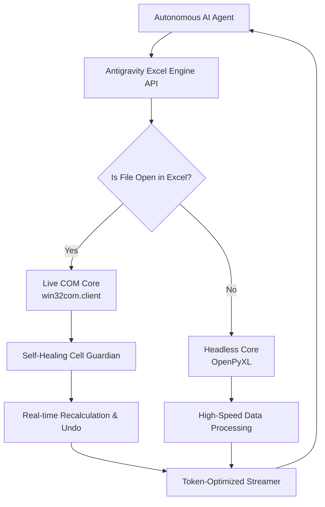

# Antigravity Excel Engine

> The Enterprise-Grade, AI-Native Excel Automation Engine for Autonomous Agents and Data Pipelines.


*Created by Francisco Grandón Vergara*

---

## 🌍 Resumen / Summary (Español)
**Antigravity Excel Engine** es un motor de automatización dual (COM + Headless) diseñado específicamente para agentes de Inteligencia Artificial y flujos de datos a nivel empresarial. Resuelve los problemas clásicos de integración con Excel: bloqueos cuando el usuario edita una celda, consumos excesivos de tokens en LLMs, y fugas de memoria por procesos huérfanos.

## ⚠️ The Problem

Traditional Excel automation libraries fail when integrated with autonomous AI agents:
- **Win32 COM Freezes:** If a human user is actively typing in a cell, classic COM scripts crash or freeze with `RPC_E_SERVERCALL_RETRYLATER`.
- **OpenPyXL Limitations:** It doesn't update the screen in real-time and cannot evaluate complex formulas.
- **LLM Token Waste:** LLMs waste up to 75% of their token context window when receiving bulky JSON structures instead of optimized data streams.
- **Zombie Processes:** Failed scripts often leave hidden `EXCEL.EXE` processes running in the background.

## 🚀 The Solution: Antigravity Excel Engine

This engine introduces several key innovations for AI-native workflows:

*   **Dual-Core Architecture:** Auto-detects if the target Excel file is currently open. If open, it uses **Live COM** for dynamic recalculation and visual updates (even supports Undo `Ctrl+Z`). If closed, it falls back to **Headless OpenPyXL** for maximum speed.
*   **Token-Optimized CSV Streamer:** Drastically reduces LLM token consumption by packing Excel data into dense, normalized CSV-like outputs instead of verbose JSON.
*   **Self-Healing Cell-Edit Mode:** Implements an adaptive exponential backoff mechanism that safely catches and resolves `0x8001010A` errors when humans are editing cells.
*   **Declarative Atomic Mapping:** A unified `set_cells` API that supports values, formulas, comments/notes, cell formatting, hex colors, and autofit in a single atomic transaction.
*   **Formula Error Guardian:** The `check_formula_errors` feature automatically audits sheets for `#VALUE!`, `#REF!`, `#DIV/0!`, and other evaluation errors.

## 🏗 Architecture



## ⚡ Quickstart

### Installation
Clone the repository and install requirements:
```bash
pip install -r requirements.txt
```

### Python API Usage
```python
from antigravity_excel_core import AntigravityExcelEngine

# Initialize the engine (auto-detects Live COM vs Headless OpenPyXL)
engine = AntigravityExcelEngine(mode="auto", file_path="C:/data/report.xlsx")

# 1. Read token-optimized CSV data (reduces LLM context tokens by up to 75%)
csv_data = engine.get_range_as_csv("A1:D100")
print(csv_data)

# 2. Declarative Atomic Mapping (values, dynamic formulas, hex styles, notes)
engine.set_cells({
    "A1": {"value": "Revenue", "cellStyles": {"fontWeight": "bold", "backgroundColor": "#0E2E63", "fontColor": "#FFFFFF"}},
    "B1": {"formula": "=SUM(B2:B10)", "cellStyles": {"numberFormat": "$#,##0"}},
    "A2": {"value": "Q1 Target", "note": "Generated autonomously by AI Agent"}
}, autofit=True)

# 3. Audit formula errors (#VALUE!, #REF!, #DIV/0!)
errors = engine.check_formula_errors("A1:D100")
print("Detected errors:", errors)

# 4. Save changes
engine.save()
```

### CLI Usage (with Deterministic JSON output for Agents)
```bash
# Check status of Excel process and active workbook
python antigravity_excel_cli.py status --json

# Read dense CSV stream
python antigravity_excel_cli.py get-csv A1:D100 --file "report.xlsx" --json

# Set cells declaratively with auto-fit columns
python antigravity_excel_cli.py set-cells --input-file data.json --autofit --json
```

## 📊 Feature Comparison

| Feature | Antigravity Excel Engine | xlwings | openpyxl | Pure win32com |
| :--- | :---: | :---: | :---: | :---: |
| **AI Token Optimization** | ✅ | ❌ | ❌ | ❌ |
| **Dual-Core (Live + Headless)** | ✅ | ❌ | ✅ (Headless only) | ❌ (Live only) |
| **Self-Healing COM Locks** | ✅ | ❌ | N/A | ❌ |
| **Formula Audit Guardian** | ✅ | ❌ | ❌ | ❌ |
| **Zero Process Leaks** | ✅ | ⚠️ | ✅ | ❌ |

## 📄 License & Authorship

- **Author:** Francisco Grandón Vergara
- **License:** MIT License
