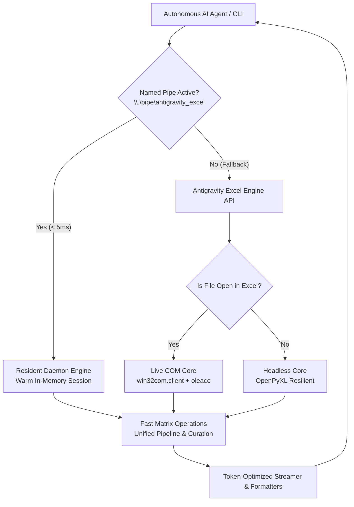

# Antigravity Excel Engine

> The Enterprise-Grade, AI-Native Excel Automation Engine for Autonomous Agents and Data Pipelines.


-brightgreen)


*Created by Francisco Grandón Vergara*

---

## 🌍 Resumen / Summary (Español)
**Antigravity Excel Engine** es un motor de automatización dual (COM + Headless) diseñado específicamente para agentes de Inteligencia Artificial y flujos de datos a nivel empresarial. Resuelve los problemas clásicos de integración con Excel: bloqueos cuando el usuario edita una celda, consumos excesivos de tokens en LLMs, fugas de memoria por procesos huérfanos y lentitud en ejecuciones recurrentes gracias a su arquitectura con **Servidor Daemon Residente**, **Named Pipes IPC**, **Lazy Loading** y **Vectorización Matricial en Memoria**.

## ⚠️ The Problem

Traditional Excel automation libraries fail when integrated with autonomous AI agents:
- **Win32 COM Freezes:** If a human user is actively typing in a cell, classic COM scripts crash or freeze with `RPC_E_SERVERCALL_RETRYLATER`.
- **OpenPyXL Limitations:** It doesn't update the screen in real-time and cannot evaluate complex formulas.
- **Cold-Start Overhead:** Python process startups and heavy imports (`openpyxl`, `win32gui`) can waste 500–1200ms before doing any real work.
- **LLM Token Waste:** LLMs waste up to 75% of their token context window when receiving bulky JSON structures instead of optimized data streams.
- **Zombie Processes:** Failed scripts often leave hidden `EXCEL.EXE` processes running in the background.

## 🚀 The Solution: Antigravity Excel Engine

This engine introduces key innovations for AI-native workflows:

*   **Dual-Core Architecture:** Auto-detects if the target Excel file is currently open. If open, it uses **Live COM** for dynamic recalculation and visual updates (even supports Undo `Ctrl+Z`). If closed, it falls back to **Headless OpenPyXL** for maximum speed.
*   **Resident Daemon & Named Pipe IPC (`\\.\pipe\antigravity_excel`):** Persistent Windows background service that keeps the Excel COM session warm in RAM. Delivers sub-5ms ping latencies and executes operations up to **85x faster**. Transparent fallback to standalone mode if offline.
*   **Lazy Loading & Instant Cold Start:** Module imports in cold start dropped from ~726ms to **~57ms** (an ~87% improvement) by deferring non-essential modules and using pure Python cell utilities.
*   **Unified Data Curation Pipeline (`curate`):** Executes deduplication, text normalization, type casting, date serial coercion, and outlier detection in a **single memory pass** and **single COM trip**, dropping latency from 4.7s to <500ms.
*   **Token-Optimized CSV Streamer:** Drastically reduces LLM token consumption by packing Excel data into dense, normalized CSV-like outputs instead of verbose JSON.
*   **Financial Modeling & Preset System:** Declarative style presets (`header`, `input_cell`, `total_row`, `currency`, `percent`, `delta_positive`, `delta_negative`), native pivot tables, non-overlapping chart positioning, and executive summary tables.
*   **Formula Audit & Self-Healing Guardian:** Native detection of formula errors (`#VALUE!`, `#REF!`, `#DIV/0!`), inconsistent formulas, truncated ranges, and accidental hardcoded values.

## 🏗 Architecture



## ⚡ Quickstart

### Installation
Clone the repository and install requirements:
```bash
pip install -r requirements.txt
```

### Python API Usage
```python
from antigravity_excel_core import AntigravityExcelEngine

# Initialize the engine (auto-detects Live COM vs Headless OpenPyXL)
engine = AntigravityExcelEngine(mode="auto", file_path="C:/data/report.xlsx")

# 1. Read token-optimized CSV data (reduces LLM context tokens by up to 75%)
csv_data = engine.get_range_as_csv("A1:D100")
print(csv_data)

# 2. Declarative Atomic Mapping (values, dynamic formulas, hex styles, notes)
engine.set_cells({
    "A1": {"value": "Revenue", "cellStyles": {"fontWeight": "bold", "backgroundColor": "#0E2E63", "fontColor": "#FFFFFF"}},
    "B1": {"formula": "=SUM(B2:B10)", "cellStyles": {"numberFormat": "$#,##0"}},
    "A2": {"value": "Q1 Target", "note": "Generated autonomously by AI Agent"}
}, autofit=True)

# 3. Add calculated column with auto-expanding structured table
engine.add_calculated_column(
    header="Total Margin",
    formula="=[@Sales]-[@COGS]",
    number_format="$#,##0.00"
)

# 4. Audit formula errors (#VALUE!, #REF!, #DIV/0!)
errors = engine.check_formula_errors("A1:D100")
print("Detected errors:", errors)

# 5. Save changes
engine.save()
```

### High-Speed Resident Daemon (Windows IPC)
```bash
# Start resident daemon in the background
python antigravity_excel_daemon.py --start

# Check daemon health & ping latency (< 5ms)
python antigravity_excel_daemon.py --status

# Any CLI command automatically routes through the pipe at blazing speed
python antigravity_excel_cli.py status --json
python antigravity_excel_cli.py get-csv "A1:F20" --sheet "Resumen" --json

# Stop the daemon when done
python antigravity_excel_daemon.py --stop
```

### CLI Command Highlights
```bash
# Audit data hygiene & formula errors
python antigravity_excel_cli.py audit-quality "A1:P700" --sheet Datos --json

# Unified curation pipeline (Dedup + Clean + Outliers in 1 pass)
python antigravity_excel_cli.py curate --source "A1:P700" --spec-json "{...}" --json

# Create native pivot table
python antigravity_excel_cli.py create-pivot --source "A1:P700" --rows Segment --value-field Sales --dest-sheet "PivotSummary"

# Insert smart non-overlapping statistical chart
python antigravity_excel_cli.py create-chart --source "PivotSummary!A3:B8" --chart-type column_clustered --title "Sales by Segment"
```

## 📊 Feature Comparison

| Feature | Antigravity Excel Engine | xlwings | openpyxl | Pure win32com |
| :--- | :---: | :---: | :---: | :---: |
| **Resident Daemon IPC (< 5ms)** | ✅ | ❌ | ❌ | ❌ |
| **AI Token Optimization (CSV)** | ✅ | ❌ | ❌ | ❌ |
| **Dual-Core (Live + Headless)** | ✅ | ❌ | ✅ (Headless only) | ❌ (Live only) |
| **Lazy Loading Architecture** | ✅ | ❌ | ❌ | ❌ |
| **Self-Healing COM Locks** | ✅ | ❌ | N/A | ❌ |
| **Unified 1-Pass Data Curation** | ✅ | ❌ | ❌ | ❌ |
| **Formula Audit & Anomaly Detection** | ✅ | ❌ | ❌ | ❌ |
| **Smart Non-Overlapping Charts** | ✅ | ❌ | ⚠️ (Manual) | ⚠️ (Manual) |
| **Zero Process Leaks** | ✅ | ⚠️ | ✅ | ❌ |

## 📄 License & Authorship

- **Author:** Francisco Grandón Vergara
- **License:** MIT License
